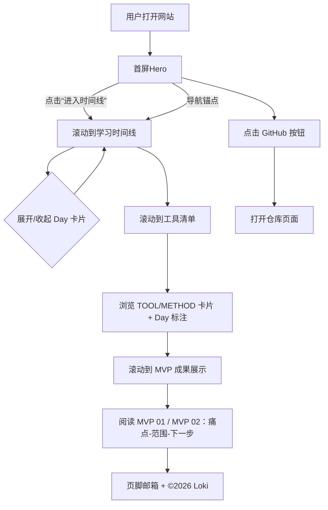

# 产品需求文档（PRD）：Loki's Notes and Review - V0.1

## 1. 综述 (Overview)

### 1.1 项目背景与核心目标
你需要完成一个可公网访问的展示站，用于向同学展示你在 Vibe Coding 课程 Day 01-07 的学习旅程（笔记与复盘），并以两个 MVP 作为成果示例；优先完成基础版作业的“可访问网页 + GitHub + Vercel 部署”。

核心目标：
- 用“时间线叙事”讲清楚 Day 01-07 的学习主线与收获
- 以独立板块展示两个 MVP（仅展示，不做交互 Demo）
- 响应式与移动端适配，视觉风格参考 `webSite2`（暗色赛博 + 霓虹红）

非目标（V0.1 不做）：
- 进阶作业：AI 数字分身/对话机器人
- PDF 笔记下载入口（不公开 pdf_reference）
- 多页面站点、MVP 在线体验/表单生成

### 1.2 核心用户旅程（页面结构主线）
1. 进入首屏：看到站名、Slogan、主视觉，点击“进入时间线”
2. 学习时间线：手风琴浏览 Day 01-07（默认展开 Day 01，可多开）
3. 工具清单：工具墙（TOOL 卡片）+ 方法论墙（METHOD 卡片），均标注出现的 Day
4. MVP 成果展示：按顺序展示 MVP 01（Prompt 库）与 MVP 02（简历生成器）
5. 页脚：邮箱联系与署名（仅 Loki，不含真实姓名）

### 1.3 Mermaid（用户操作流）


## 2. 用户故事 (User Stories)

### 阶段一：首屏与导航

#### US-01：作为访客，我希望一进站就知道这是什么站，以便快速进入阅读主线
- 业务逻辑
  1. 首屏展示：站名 `Loki's Notes and Review`
  2. 展示副标题：`认真做好每一次笔记与复盘，从模仿到超越`
  3. 主按钮：`进入时间线`，点击滚动到“学习时间线”
  4. 首屏主视觉：临时使用“红发Q版少年 + 火焰/红色能量特效”占位图（可替换）
- 验收标准
  - GIVEN 用户打开页面
  - WHEN 首屏加载完成
  - THEN 能看到站名/副标题/主视觉/“进入时间线”按钮，且按钮可滚动到时间线区域

#### US-02：作为访客，我希望能随时用导航跳到关键部分，以便快速定位内容
- 业务逻辑
  1. 顶部固定导航栏（桌面端显示锚点：学习时间线/工具清单/MVP 成果展示 + GitHub）
  2. 移动端使用汉堡菜单展开锚点；GitHub 保持可见
  3. GitHub 按钮跳转到：`https://github.com/Cong0ks/Loki-s-Notes-and-Review.git`
- 验收标准
  - GIVEN 用户在页面任意位置
  - WHEN 点击某个锚点
  - THEN 页面滚动到对应区块，区块标题清晰可见
  - GIVEN 用户点击 GitHub
  - THEN 在新标签页打开仓库链接

### 阶段二：学习时间线（Day 01-07）

#### US-03：作为访客，我希望按 Day 01-07 浏览学习要点，以便理解你的学习路径
- 业务逻辑
  1. 时间线使用手风琴卡片：默认只展开 Day 01
  2. 允许同时展开多个 Day
  3. 每个 Day 固定字段（精简 3-5 条，固定 4 类）：
     - 主题一句话
     - 用到的工具（仅你实际用过）
     - 最重要的 1 条方法论
     - 我接下来要怎么做
  4. 不展示授课老师信息；不出现“毕业作业/名片”字样
- 内容（当前定稿标题）
  - Day 01：Vibe Coding 从听到用
  - Day 02：用 Enter 把点子做成第一个 MVP
  - Day 03：会调 API 的网页：从页面到简单 Agent
  - Day 04：AI 编程从 Chat 到 Agent
  - Day 05：产品开发流程初识
  - Day 06：上线与部署实战：GitHub + Vercel 踩坑记录
  - Day 07：MVP 极简与收敛：从能用到能讲清楚
- 验收标准
  - GIVEN 用户进入“学习时间线”
  - WHEN 页面首次渲染
  - THEN Day 01 展开，Day 02-07 默认收起
  - WHEN 用户展开任意 Day
  - THEN 该 Day 展示固定 4 类信息，且不影响其它已展开 Day

### 阶段三：工具清单（工具墙 + 方法论墙）

#### US-04：作为访客，我希望看到你用过的工具与方法论的“墙”，以便快速获取复用线索
- 业务逻辑
  1. “工具清单”一个板块内分两区：
     - 【工具】TOOL：软件/平台/命令行/服务
     - 【方法论】METHOD：方法论/关键产出
  2. 两区都默认展开（不折叠）
  3. 卡片右上角 Tag：`TOOL` / `METHOD`（红黑体系内轻区分）
  4. 每张卡片标注 Day：使用文字列表 `Day 01, Day 02`（不使用圆点徽章）
- 验收标准
  - GIVEN 用户滚动到“工具清单”
  - THEN 能清晰区分 TOOL 与 METHOD 两区
  - AND 每张卡片都有 Tag 与 Day 标注（格式为 Day xx）

### 阶段四：MVP 成果展示（仅展示）

#### US-05：作为访客，我希望看到你做过的两个 MVP 示例，以便理解成果与后续方向
- 业务逻辑
  1. MVP 区块位于：时间线之后、工具清单之后（顺序：时间线 -> 工具清单 -> MVP）
  2. 标题：`MVP 成果展示`
  3. 展示顺序：先 MVP 01（Prompt 记录器/Prompt 库），后 MVP 02（简历生成器）
  4. 每个 MVP 卡片固定 3 项：
     - 痛点/场景（一句话）
     - MVP 范围（3条）
     - 下一步迭代（一句话）
  5. 不做交互体验；截图可选，不强制
- 已确认文案
  - MVP 01 痛点/场景：帮助用户把已经验证过的好想法安静保存下来、不打断当下专注，并在真正需要时由用户亲自唤醒的认知工具。
  - MVP 01 范围：新建与保存提示词；基础分类管理；关键词搜索查找。
  - MVP 01 下一步：增加 LLM 的 API 接入，扩展更多智能化功能。
  - MVP 02 痛点/场景：帮助多年未求职的职场人快速生成符合当前招聘市场标准的专业简历，解决简历写法过时和重复填写多个平台的痛点。
  - MVP 02 范围：收集关键信息的表单；一键生成简历的触发按钮；输出结构化简历文本。
  - MVP 02 下一步：通过对话式 Q&A 自动补全与填写信息，帮用户更轻松生成一份更专业的简历。
- 验收标准
  - GIVEN 用户进入 MVP 区块
  - THEN 能按顺序看到两个 MVP 卡片，且每个卡片包含上述 3 类信息

### 阶段五：页脚与联系

#### US-06：作为访客，我希望能找到你的联系方式与署名，以便后续交流
- 业务逻辑
  1. 页脚展示邮箱：`hopelove16@163.com`
  2. 不展示真实姓名，仅使用 Loki
  3. 展示：`© 2026 Loki`
  4. 导航栏不增加“联系”锚点
- 验收标准
  - GIVEN 用户滚动到页脚
  - THEN 能看到邮箱与 `© 2026 Loki`

## 3. 页面布局线框（ASCII Wireframe）

### 3.1 桌面端（单页滚动）
```text
┌──────────────────────────────────────────────────────────────────┐
│ NAV: Loki's Notes and Review | 时间线 | 工具清单 | MVP成果 | GitHub │
└──────────────────────────────────────────────────────────────────┘

┌──────────────────────────────────────────────────────────────────┐
│ HERO                                                             │
│  标题：Loki's Notes and Review                                   │
│  副标题：认真做好每一次笔记与复盘，从模仿到超越                     │
│  [ 进入时间线 ]                        (主视觉插画占位)            │
└──────────────────────────────────────────────────────────────────┘

┌──────────────────────────────────────────────────────────────────┐
│ 学习时间线  (#timeline)                                           │
│  [v] Day 01 标题...                                                │
│      主题/工具/方法论/下一步                                       │
│  [>] Day 02 标题...                                                │
│  [>] Day 03 ...                                                    │
│  ... Day 07 ...（可多开）                                          │
└──────────────────────────────────────────────────────────────────┘

┌──────────────────────────────────────────────────────────────────┐
│ 工具清单  (#tools)                                                │
│  【工具】 TOOL 卡片墙（卡片角标 TOOL + Day 列表）                  │
│  【方法论】 METHOD 卡片墙（卡片角标 METHOD + Day 列表）            │
└──────────────────────────────────────────────────────────────────┘

┌──────────────────────────────────────────────────────────────────┐
│ MVP 成果展示  (#mvp)                                              │
│  MVP 01 卡片：痛点/范围(3)/下一步                                  │
│  MVP 02 卡片：痛点/范围(3)/下一步                                  │
└──────────────────────────────────────────────────────────────────┘

┌──────────────────────────────────────────────────────────────────┐
│ FOOTER                                                            │
│  Email: hopelove16@163.com                                         │
│  © 2026 Loki                                                       │
└──────────────────────────────────────────────────────────────────┘
```

### 3.2 移动端导航（汉堡菜单）
```text
┌──────────────────────────────────────────────┐
│ Loki's Notes and Review            [GitHub] ≡ │
└──────────────────────────────────────────────┘
(点 ≡ 展开)
┌──────────────────────────────────────────────┐
│ - 学习时间线                                  │
│ - 工具清单                                    │
│ - MVP 成果展示                                │
└──────────────────────────────────────────────┘
```

## 4. 视觉与交互规范（V0.1）
- 风格：参考 `webSite2`（暗色赛博 + 霓虹红强调色）
- 字体气质：偏“科技感/窄/硬朗”
- 动效：少量克制（首屏淡入、滚动进入区块轻微上浮/发光）；需支持 prefers-reduced-motion 降级
- 可替换资产：Hero 主视觉为占位图，后续可替换为最终 Loki 形象

## 5. 非功能性需求
- 响应式：桌面/移动端均可读、可用
- 可访问性：对比度足够、焦点可见、键盘可操作（手风琴可切换）
- 性能：首屏资源尽量轻，图片可压缩；避免阻塞渲染
- 部署：通过 GitHub 托管代码，使用 Vercel 部署获得公网可访问链接（基础作业提交要求）

## 6. 风险与待确认
- Hero 主视觉占位图：后续替换素材与版权来源需确认
- 工具清单与方法论卡片的最终粒度：可能需要合并同类项避免卡片过多
- 是否补充少量截图：可提升观感，但非硬性

## 7. 版本规划
- V0.1：按本 PRD 完成单页展示站并上线 Vercel（满足基础作业）
- V0.2（可选）：补充截图/动效精修/更强叙事
- V1.0（进阶作业可选）：嵌入对话机器人（System Prompt 注入个人与项目背景）

